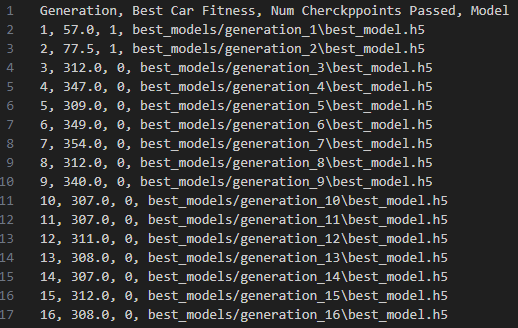

# Drive_IO

This program impelemts a genetic algorithm to train a car to drive around a simulated track. Currently this code is still a work in progress. I am still working to create a better fitness function, optimize hyperparameters, and create a good way to view all of the simulated cars in pygame to see the results. Below is my analysis of the results:

## Data preprocessing
In genetic algorithms, you do not have the same style of training loop, so I did not have a data set that I was working with. Instead I understood that I needed to create data for each of the cars to use to make decisions. I designed each car to have multiple sensors that find the closest wall of the map in the direction that the sensor looks. This process of deciding how a car should be gathering information was what I would qualify as preprocessing. Each value from the sensors would be put into a vector for use.

## Selection, training, and use of a machine learning model
In my project I used a few dense layers in a classic feed forward neural network as the decision maker for each car. It takes in the vector of the sensor's outputs, then decides which cardinal direction to drive (It can also drive diagonally, or not pick a direction on any given output). A genetic algorithm works slightly differently than the traditional machine learning cycle of training, backpropagation, and testing. I started with each car having a model with completely random weights. Each generation, I would pick the two cars that did the best and create new cars based off of them. This would be most similar to how the model becomes trained. Over time, and a process similar to natural selection, the model learns how to become better at driving. I defined what being “The Best” means through use of a fitness function that takes into account how far a car has gone on the track and how fast it does it as well.

## Interpretation of results (for example, using proper metrics, understanding limitations)
The way that I interpreted the results was through tracking the fitness score of the best cars each generation and how many checkpoints that it passed. I also saved the model from each of those best cars so that I can play those simulations back later. What I found was that my program was able to optimize quickly to get a high fitness score! Unfortunately I realized that I made a small exploit when designing my fitness score. The limitations as I have learned through experience is that defining a fitness function can be complicated. We have to know exactly what we want and how to define it, or the programs will find local minima in optimizing things that we did not intend.

## Communication of results
 

The score relies heavily on the fact that the cars have passed a checkpoint. So before it passed any score, I wanted to have an easy way to give a flat score to the cars based on how far to the right the car goes, but therelied a flaw in my program. Because of this each car goes right up to the line where the checkpoint is and crashes into the wall to lock in the high score it has for going to the right before it drops down to the normal scoring system. To fix this I just plan to heavily increase the bonus for going through a checkpoint so that it will optimize going through as many of those as possible.

## Ethical implications
On the ethical side of things, I actually think that genetic algorithms excel quite a bit. Because there is no training data, there is no chance that you are using data that you should not have access to. In many types of systems that use genetic algorithms, they have to generate their own data to solve a task through use of cameras, sensors, and other means. Observing the world around you and deciding how to act because of it is not illegal or morally wrong. I think this type of method is also fairly more transparent and easy for people to understand than some other machine learning strategies, which can also help the public and employers feel comfortable around these models and learning methods. 

## Next steps
The next things I would want to do in this project is continue to refine it so that each individual car can complete the track. I also would want to work with some way to get the visuals to work outside of the computation. As I made the project I had to remove the visualization in order to improve computation speeds. I believe if I compute each cars moves for that generation and store them in a file, then modify the visuals to run off of that file, it could work well.
